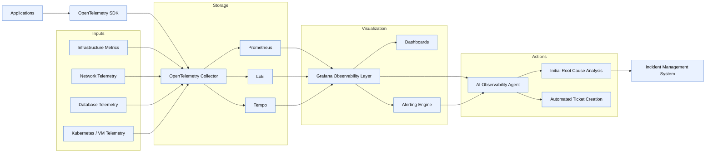

# 3. Observability Reference Architecture

[↑ Back to TOC](toc.md)

| Version | Owner | Classification | Reviewed Date | Status |
|---|---|---|---|---|
| 0.1 | TBD | Internal |  | Draft |
---

## 3.1 Architectural Principles
- **Centralised Data Collection.** All telemetry consolidated in a unified platform to break down silos and enable cross-pillar correlation.
- **Open Standards.** Vendor-neutral instrumentation (OpenTelemetry) to avoid lock-in and simplify integration.
- **Tool Selection.** Grafana selected as primary visualization and alerting tool based on scalability, ease of use, and cost.
- **Containerized Delivery.** The observability platform is delivered as containerized services, with implementation chosen per environment (for example Kubernetes, Docker Compose, or equivalent platform-managed container deployment).
- **Single Pane of Glass.** Unified view across infra, application, and business layers.
- **Reproducible Deployment.** IaC and deployment automation are version-controlled, repeatable, and environment-aware, with platform-specific configuration, dashboards, and alert rules managed as code.
- **Deployment-Model Awareness.** Universal observability — consistent logs + metrics + traces + events across all runtimes — is implemented in a model-aware manner, not one-size-fits-all. Deployment topology (on-prem, customer site, cloud VM) directly shapes what can be instrumented, the context that can be captured, and where telemetry can be stored or processed; trace continuity, data ownership, and cost control follow from those choices.
- **Application / Infrastructure Convergence.** Application-stack tooling has been pre-selected and the infrastructure stack is broadly guided by Azure-native capabilities; this architecture brings application and infrastructure insights together into a single pane of glass within those constraints.

## 3.2 High-Level Architecture (Logical View)




The backend platform (Collector, Prometheus, Loki, Tempo, Grafana, exporters) is deployed as a **containerized observability stack**. Exact deployment tooling is environment-specific and may use Kubernetes, Docker Compose, or equivalent orchestration and automation patterns. See [8. IaC for Observability Standard](08-iac-for-observability-standard.md).

## 3.3 Core Concepts

| Component | Role |
|---|---|
| OpenTelemetry Collector | Universal telemetry gateway: receives metrics/logs/traces from instrumented services and exporters, performs processing/enrichment, forwards to backends. Standardises ingestion and simplifies pipeline management. |
| Prometheus | Stores and queries metrics for performance, capacity, and health monitoring. |
| Loki | Stores structured logs; enables efficient querying and correlation with metrics/traces. |
| Tempo | Stores distributed traces; provides end-to-end visibility into request flows and dependencies. |
| Grafana | Dashboards, exploration views, and visual analytics across metrics, logs, and traces. |
| Agentic AI Layer | Consumes telemetry via APIs from Prometheus/Loki/Tempo to perform automated RCA, anomaly detection, and enriched incident-ticket generation. |
| Container Orchestrator / Runtime | Deployment substrate for the observability stack — Kubernetes, Docker Compose, or equivalent environment-standard runtime. |
| IaC / Automation Layer | Provisions environments, renders configs, applies deployments, validates health, and emits deployment telemetry. |

## 3.4 Core Open-Source Stack

| Layer | Tool | Role |
|---|---|---|
| Telemetry Standard | OpenTelemetry | Unified instrumentation standard for metrics, logs, traces |
| Telemetry Gateway | OpenTelemetry Collector | Central pipeline receiving, processing, exporting telemetry |
| Metrics Storage | Prometheus | Infra and application metrics |
| Logs Storage | Loki | Structured logs |
| Traces Storage | Tempo | Distributed traces |
| Visualization | Grafana | Dashboards, exploration, analytics |
| Host Observability | Node Exporter | OS-level metrics (CPU/mem/disk/net) on every host |
| Container Observability | cAdvisor | Per-container CPU/memory/I/O metrics |
| Network Monitoring | Host-level network metrics via Node Exporter; network probes / synthetic checks via Blackbox Exporter | Network reachability, latency, packet loss |
| DB Observability | Postgres / MySQL exporter | DB query/latency/connection/error metrics |
| Alerting | Grafana Alerting / Alertmanager | Alert rules, routing, notifications |
| Deployment Unit | Docker Compose | Declarative stack definition |
| Automation / IaC | PowerShell | Provisioning, lifecycle, validation, telemetry export |
| Profiling | Pyroscope | Continuous CPU / memory / heap profiles (5th pillar) |
| Synthetic Monitoring | Blackbox Exporter / k6 | Black-box probes for HTTP, TCP, DNS, ICMP, TLS |
| Real User Monitoring (RUM) | OpenTelemetry Browser SDK | Front-end Core Web Vitals + user-journey spans |
| Auto-Instrumentation (eBPF) | Beyla (or equivalent) | Code-free L4/L7 visibility for legacy / unmodifiable services |
| Service Catalog (CMDB bridge) | Backstage / ServiceNow CMDB integration | Authoritative service identity (`service.name`, `tier`, `team`) |
| Paging / On-Call | PagerDuty / Opsgenie / Squadcast | Alert escalation and rotation management |
| Identity / Auth | Corporate IdP (OIDC / SAML) + Vault PKI | User SSO + service mTLS |
| Secrets | HashiCorp Vault / Azure Key Vault | Component credentials and bearer tokens |
| Schema Registry | OpenTelemetry semantic conventions + internal extension registry | Naming/labelling conformance |

All components are open-source or vendor-neutral; commercial choices (paging, IdP, Vault) are pluggable per [24. Observability Platform Security Architecture](24-observability-platform-security-architecture.md).

### 3.4.1 eBPF for Legacy and Non-Intrusive Instrumentation
For legacy services, vendor-supplied components, or any workload where code-level instrumentation is impractical, eBPF-based auto-instrumentation (e.g., Grafana **Beyla**, or Cilium Tetragon for security signals) provides language-agnostic visibility into HTTP, gRPC, and SQL traffic at the kernel level.

**Decision:** Beyla is recommended as a complementary layer beside the OpenTelemetry SDK kits in [26. Service Onboarding and Instrumentation Kits](26-service-onboarding-and-instrumentation-kits.md) — formalised in **ADR-012** in [17. Observability ADR Decision Register](17-observability-adr-decision-register.md).

**Use cases:**
- Vendor-supplied components without source-code access.
- Phase 1 instrumentation while SDK rollout is in progress.
- "Free" service-to-service visibility for non-priority services that do not justify SDK effort.

**Constraints:**
- Linux only (eBPF dependency).
- Less attribute fidelity than SDK instrumentation.
- Custom business attributes still require SDK.

## 3.5 Telemetry Collection Layers
Telemetry is captured across four major layers:

1. **Infrastructure (Host + Container).** Host-level metrics via Node Exporter; container-level metrics via cAdvisor. Logs collected by the OpenTelemetry Collector or a log-shipping agent (e.g. Promtail).
2. **Application.** Pre-login (auth/MFA/API gateway) and post-login (transactions, dependencies, journeys). OpenTelemetry SDK in each service exports OTLP to the Collector. See [18. Application Telemetry Standard](18-application-telemetry-standard.md) for application telemetry standards.
3. **Database.** Query, lock, connection, and replication telemetry via dedicated exporters as Compose services.
4. **Network & Latency.** Host-level network counters (packet drops, retransmits) plus active probes (Blackbox Exporter) for cross-service latency, DNS, and reachability.

A fifth, emerging layer — **Profiles** (Pyroscope-style stack-trace profiling) — is a near-term extension. See [2. Enterprise Observability Standards Catalog](02-enterprise-observability-standards-catalog.md).

### 3.5.1 Sampling Strategy

| Signal | Approach | Rate (default) | Rationale |
|---|---|---|---|
| Metrics | No sampling — full fidelity at scrape interval | 100% | Aggregated by definition; sampling defeats the purpose |
| Logs | Volume control via structured-log policy + level filtering | INFO+ in prod | Fine-grained by service tier (see [Chapter 2. Enterprise Observability Standards Catalog -> Section 2.4.1 Service Tiering Model](02-enterprise-observability-standards-catalog.md#241-service-tiering-model)) |
| Traces (head-based, baseline) | `parentbased_traceidratio` at SDK | T1 10%, T2 5%, T3 1%, T4 0.1% | Decision propagates with `traceparent`; lightweight |
| Traces (tail-based, gateway) | Tail sampling at gateway Collector | 100% of errors + 100% of slow (> P95) + N% of normal | Captures the interesting traces; downsamples the rest |

**Decision** formalised in **ADR-013**.

## 3.6 Containerized Deployment Design
The observability stack runs as containerized services in every environment (development, test, staging, production; on-prem, customer-hosted, cloud VM, or managed cluster). The design is deployment-model aware rather than tied to one runtime or one cloud-specific platform.

**Advantages:**
- **Centralized Dashboards.** Unified Grafana view regardless of where the stack runs.
- **Unified Telemetry Schema.** Same metric names, labels, log fields, trace attributes everywhere.
- **Cross-Host Incident Visibility.** Incidents that span hosts / sites remain visible in a single context.
- **Operational Flexibility.** Teams can use the container orchestration layer that fits their environment while preserving the same observability standards and telemetry contracts.

**Design constraints (see [8. IaC for Observability Standard](08-iac-for-observability-standard.md) for KPIs):**
- **Cross-environment config parity ≥ 95%** between deployments of the same tier.
- **Image / deployment-version alignment 100%** within a tier.
- **Health-check pass rate 100%** post-deployment.
- All deployment is reproducible from Git via approved automation.

### 3.6.1 Network Topology and Trust Boundaries
```
┌──────────────────────────────────────────────────────────────────────┐
│  Service / Customer Network Zone                                     │
│  ┌──────────┐   ┌──────────┐   ┌──────────┐                          │
│  │ Service  │   │ Service  │   │ Service  │   (instrumented w/ SDK)  │
│  └────┬─────┘   └────┬─────┘   └────┬─────┘                          │
│       │ OTLP/mTLS    │              │                                │
│       └──────────────┴──────────────┘                                │
│                      │                                               │
│  ┌───────────────────▼──────────────────┐                            │
│  │  Edge OTel Collector  (per host)     │  ← attribute enrich, redact│
│  └───────────────────┬──────────────────┘                            │
└──────────────────────┼───────────────────────────────────────────────┘
                       │ TLS 1.3 + bearer token
                       │ ─── trust boundary ───
┌──────────────────────▼───────────────────────────────────────────────┐
│  Observability Platform Zone (DMZ-like)                              │
│  ┌─────────────────────────────────────┐                             │
│  │  Gateway OTel Collector (HA pair)   │  ← tenant injection, tail   │
│  │                                     │     sampling, redaction     │
│  └────────┬────────────────────────────┘                             │
│           │                                                          │
│  ┌────────▼─────┐ ┌─────────┐ ┌───────┐ ┌──────────┐                 │
│  │  Prometheus  │ │  Loki   │ │ Tempo │ │ Pyroscope│                 │
│  └────────┬─────┘ └────┬────┘ └───┬───┘ └────┬─────┘                 │
│           │            │          │          │                       │
│  ┌────────▼────────────▼──────────▼──────────▼──────┐                │
│  │  Grafana (HA pair)  +  Alertmanager (3-cluster)  │                │
│  └────────┬─────────────────────────────────────────┘                │
└───────────┼──────────────────────────────────────────────────────────┘
            │ OIDC + MFA
┌───────────▼──────────────────────────────────────────────────────────┐
│  User Zone (Devs / SRE / Ops / Auditors / Execs)                     │
└──────────────────────────────────────────────────────────────────────┘
                       │  egress allow-list
                       ▼
              [ Pager / SIEM / LLM ]
```
**Trust boundaries:**
- **Service ↔ Edge Collector:** mTLS, service identity.
- **Edge ↔ Gateway:** TLS + bearer token (per-host or per-tenant).
- **Gateway ↔ Backends:** TLS + service auth.
- **User ↔ Grafana:** OIDC SSO + MFA.
- **Platform ↔ Egress:** allow-list to known third parties; redaction enforced.

Detailed control catalogue in [24. Observability Platform Security Architecture](24-observability-platform-security-architecture.md).

## 3.7 Pipeline Processing

### 3.7.1 Pipeline Roles
- **Edge Collector (per host or per service):** receive (OTLP, file, syslog), enrich (resource attributes), redact (PII at source), batch, export to gateway.
- **Gateway Collector (HA, central):** authenticate, inject authoritative tenant ID, apply tail-sampling for traces, route per signal type to backends.
- **Backends:** durable storage and query.

### 3.7.2 Backpressure and Reliability
- `memory_limiter` aborts ingestion when memory exceeds 80% — prevents OOM.
- `sending_queue` with `file_storage` persists telemetry across collector restarts.
- `retry_on_failure` with exponential backoff handles transient backend outages.
- **`otelcol_processor_dropped_spans`** is a meta-monitor alert (see [Chapter 22. Observability Platform HA and DR Design -> Section 22.7 Self-Monitoring (Meta-Monitor)](22-observability-platform-ha-and-dr-design.md#227-self-monitoring-meta-monitor)).

### 3.7.3 Schema Validation and Cardinality Controls
- Cardinality enforcement per [Chapter 2. Enterprise Observability Standards Catalog -> Section 2.3.4 Cardinality Governance](02-enterprise-observability-standards-catalog.md#234-cardinality-governance).
- Required-attribute enforcement: `attributes/required` processor pattern rejects telemetry missing any of `service.name`, `tier`, `tenant_id`.
- Recording rules in Prometheus / Mimir track per-service active-series count.

## 3.8 Cross-References
- [2. Enterprise Observability Standards Catalog](02-enterprise-observability-standards-catalog.md) — telemetry standards consumed by this architecture.
- [6. Grafana Platform Standard and Visualization Playbook](06-grafana-platform-standard-and-visualization-playbook.md) — Grafana platform standards and dashboard playbook.
- [8. IaC for Observability Standard](08-iac-for-observability-standard.md) — deployment and automation standard.
- [9. Observability Data Governance and Retention Policy](09-observability-data-governance-and-retention-policy.md) — data lifecycle and retention applied to backends.
- [20. Observability Data Model Specification](20-observability-data-model-specification.md) — formal data model for entities/relationships across pillars.
- [22. Observability Platform HA and DR Design](22-observability-platform-ha-and-dr-design.md) — HA topology overlaid on this architecture.
- [23. Capacity and Scale Model](23-capacity-and-scale-model.md) — sizing and scale-out triggers.
- [24. Observability Platform Security Architecture](24-observability-platform-security-architecture.md) — auth, encryption, redaction, supply-chain.
- [27. Multi-Tenant and Customer-Site Deployment Model](27-multi-tenant-and-customer-site-deployment-model.md) — multi-tenant and customer-site topologies.

---

[↑ Back to TOC](toc.md)
