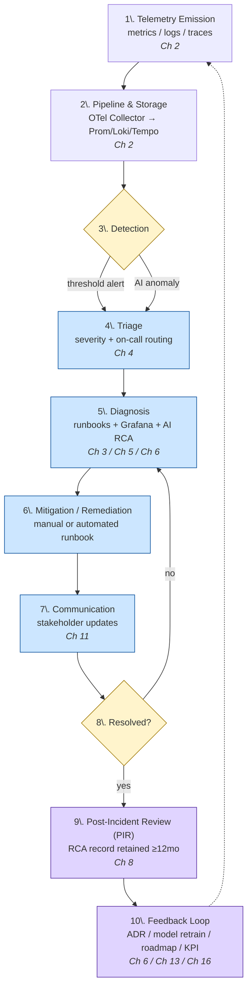

# 12. Incident Response Playbook (Telemetry to Resolution)

[↑ Back to TOC](toc.md)

| Version | Owner | Classification | Last Reviewed | Next Review | Status |
|---|---|---|---|---|---|
| 0.1 | TBD | Internal | 2026-Q2 | 2026-Q3 | Draft |

---

## 1. Purpose
How a telemetry anomaly becomes a diagnosed, communicated, remediated incident. Severities, alert rules, and AI guardrails come from [Chapter 4. Alerting and Incident Severity Policy](4-alerting-and-incident-severity-policy.md) and [Chapter 6. AIOps Guardrails and Implementation Playbook](6-aiops-guardrails-and-implementation-playbook.md); runbooks from [Chapter 3. Domain Observability Runbooks Pack](3-domain-observability-runbooks-pack.md). This playbook integrates them end-to-end.

## 2. End-to-End Incident Sequence (Logical Flow)

### 2.1. Lifecycle Flow (Mermaid Flowchart)



### 2.2. Actor Sequence (Mermaid Sequence Diagram)

```mermaid
sequenceDiagram
    autonumber
    participant Svc as Instrumented Service
    participant Pipe as OTel Collector + Storage
    participant Det as Detection (Alertmanager / AIOps)
    participant OnCall as On-Call Engineer
    participant IC as Incident Commander
    participant SO as Service Owner
    participant Comms as Stakeholders
    participant KB as PIR / Knowledge Base

    Svc->>Pipe: emit metrics / logs / traces
    Pipe->>Det: stream signals
    Det->>OnCall: page (Sev-1) or ticket (Sev-2/3)
    OnCall->>OnCall: acknowledge, open incident
    alt severity = Critical
        OnCall->>IC: engage incident commander
        IC->>Comms: open comms cadence (Ch 4 §5)
    end
    OnCall->>SO: consult runbook + service owner
    SO-->>OnCall: rollback / config / traffic-shift decision
    OnCall->>Pipe: verify mitigation via dashboards (Ch 5)
    Pipe-->>OnCall: signals returning to healthy ranges
    OnCall->>Comms: resolution announcement
    OnCall->>KB: open PIR draft within 24h
    KB->>KB: structured RCA record (Ch 8 retention)
    KB-->>IC: PIR reviewed; corrective actions assigned
    IC-->>SO: track never-repeat items (Ch 16 ADR if systemic)
```

### 2.3. Step-by-Step Description

| # | Step | Owner | Cross-Reference |
|---|---|---|---|
| 1 | Telemetry emission from instrumented services | Service Owner | [Chapter 2. Observability Reference Architecture](2-observability-reference-architecture.md) |
| 2 | Pipeline & storage (OTel Collector → Prom/Loki/Tempo) | Platform | [Chapter 2. Observability Reference Architecture](2-observability-reference-architecture.md) |
| 3 | Detection (threshold or AI anomaly) | Platform | [Chapter 4. Alerting and Incident Severity Policy](4-alerting-and-incident-severity-policy.md), [Chapter 6. AIOps Guardrails and Implementation Playbook](6-aiops-guardrails-and-implementation-playbook.md) |
| 4 | Triage — severity, ack, routing | On-Call | [Chapter 4. Alerting and Incident Severity Policy](4-alerting-and-incident-severity-policy.md) |
| 5 | Diagnosis via runbooks + Grafana + AI RCA | On-Call + Service Owner | [Chapter 3. Domain Observability Runbooks Pack](3-domain-observability-runbooks-pack.md), [Chapter 5. Grafana Platform Standard and Visualization Playbook](5-grafana-platform-standard-and-visualization-playbook.md), [Chapter 6. AIOps Guardrails and Implementation Playbook](6-aiops-guardrails-and-implementation-playbook.md) |
| 6 | Mitigation / remediation | Service Owner | [Chapter 3. Domain Observability Runbooks Pack](3-domain-observability-runbooks-pack.md) |
| 7 | Communication to stakeholders | Incident Commander | [Chapter 11. Observability KPI Scorecard](11-observability-kpi-scorecard.md) |
| 8 | Resolution & verification (metrics healthy, alerts auto-resolve) | On-Call | [Chapter 5. Grafana Platform Standard and Visualization Playbook](5-grafana-platform-standard-and-visualization-playbook.md) |
| 9 | Post-Incident Review (PIR) — structured RCA record | Incident Commander | [Chapter 8. Observability Data Governance and Retention Policy](8-observability-data-governance-and-retention-policy.md) |
| 10 | Feedback — ADR, model retraining, roadmap, KPI updates | Governance Body | [Chapter 6. AIOps Guardrails and Implementation Playbook](6-aiops-guardrails-and-implementation-playbook.md), [Chapter 13. Observability Roadmap Delivery Plan](13-observability-roadmap-delivery-plan.md), [Chapter 16. Observability ADR Decision Register](16-observability-adr-decision-register.md) |

## 3. Roles
| Role | Responsibility |
|---|---|
| On-Call Engineer | First responder; triage, diagnosis, communication. |
| Incident Commander | Coordinates response for Critical incidents; owns comms cadence. |
| SRE / Platform Ops | Owns runbook execution and platform-level remediation. |
| Service Owner | Owns service-specific decisions (rollback, traffic shifting). |
| Governance Body | Reviews PIR outcomes; ratifies systemic changes ([Chapter 15. Observability Governance Charter and ARB Pack](15-observability-governance-charter-and-arb-pack.md)). |

## 4. Incident Severity Mapping
Inherited from [Chapter 4. Alerting and Incident Severity Policy -> Section 3. Standard Severity Model](4-alerting-and-incident-severity-policy.md#3-standard-severity-model):

| Severity | Response | Comms |
|---|---|---|
| Info / Tracking | Trend logged; no action | None |
| Warning | Investigated within business hours | Internal channel post |
| Critical | Page on-call immediately; commander engaged | Stakeholder updates per cadence |

## 5. Diagnosis Aids
- **Grafana correlation panels** — dashboards link metrics ↔ logs ↔ traces via shared identifiers (see [Chapter 5. Grafana Platform Standard and Visualization Playbook](5-grafana-platform-standard-and-visualization-playbook.md)).
- **AI-generated RCA tickets** — pre-populated with context, impact assessment, and suggested remediation (see [Chapter 6. AIOps Guardrails and Implementation Playbook](6-aiops-guardrails-and-implementation-playbook.md)).
- **Domain runbooks** — see [Chapter 3. Domain Observability Runbooks Pack](3-domain-observability-runbooks-pack.md) for infra, application, DB, network, scaling.

## 6. Post-Incident Review (PIR)
For each major incident, a structured RCA record is captured with:
- Timeline of detection → mitigation → resolution.
- Customer / business impact (revenue, sessions, SLA).
- Root cause and contributing factors.
- Corrective actions and **never-repeat** items.

PIRs are stored in a central knowledge base for **at least 12 months** (per [Chapter 8. Observability Data Governance and Retention Policy -> Section 4. Worked Example: Applying Retention Policy (subsection 4.4)](8-observability-data-governance-and-retention-policy.md#4-worked-example-applying-retention-policy)).

## 7. Success Criteria
- MTTD reduced per phase targets (see [Chapter 11. Observability KPI Scorecard](11-observability-kpi-scorecard.md) / [Chapter 14. Observability Capability Assessment Framework](14-observability-capability-assessment-framework.md)).
- ≥ 90% incidents have an identified root cause.
- > 90% automated ticket creation by Phase 3 maturity.
- Demonstrable reuse of PIR records in subsequent reviews and risk assessments.

## 8. Cross-References
- [Chapter 3. Domain Observability Runbooks Pack](3-domain-observability-runbooks-pack.md) — domain runbooks.
- [Chapter 4. Alerting and Incident Severity Policy](4-alerting-and-incident-severity-policy.md) — severity policy & routing.
- [Chapter 5. Grafana Platform Standard and Visualization Playbook](5-grafana-platform-standard-and-visualization-playbook.md) — Grafana correlation tooling.
- [Chapter 6. AIOps Guardrails and Implementation Playbook](6-aiops-guardrails-and-implementation-playbook.md) — AI RCA & automated ticketing.
- [Chapter 11. Observability KPI Scorecard](11-observability-kpi-scorecard.md) — incident-related KPIs.
- [Chapter 13. Observability Roadmap Delivery Plan](13-observability-roadmap-delivery-plan.md) — phase-aligned automation roadmap.
- [Chapter 16. Observability ADR Decision Register](16-observability-adr-decision-register.md) — decision register for systemic incident-driven changes.

---

[↑ Back to TOC](toc.md)
