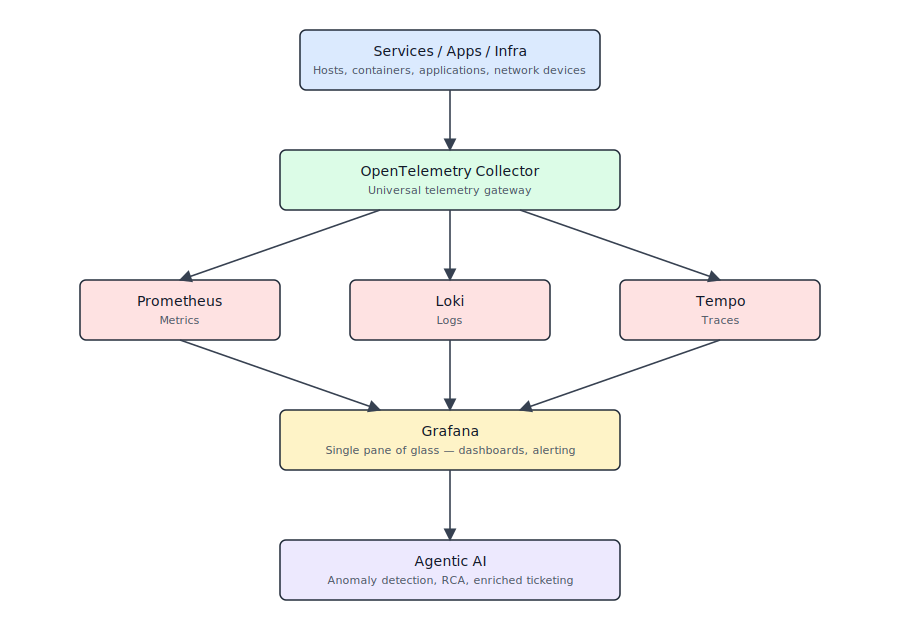

# 1. Xceedance Observability Strategy

[Next Page](02-enterprise-observability-standards-catalog.md)

| **Document Owner** | CoE-Architecture |
| --- | --- |
| **Approved By** | Simon Armstrong (pending wider review) |
| **Classification** | Internal |
| **Review Frequency** | Quarterly |
| **First Review** | 1-Aug-2026 |
| **Next Review Due** | 1-Nov-2026 |

## 1.0 Reader Guide

**Audience:**
- **Technology leaders and architects** who need a coherent reference for how observability is designed and governed.
- **SRE / Platform / Infrastructure engineers** who build and operate the observability stack.
- **Application teams** who must onboard services, instrument code, and consume dashboards and alerts.
- **Risk, compliance, and security stakeholders** who rely on observability data for audit, governance, and investigations.

**Recommended path through the pack:**
- **Start with Chapters 1–3** to understand strategy, standards, and reference architecture.
- Use **Chapters 4–7 and 26** when implementing runbooks, alerting, Grafana, AIOps, and service onboarding.
- Refer to **Chapters 8–10, 22–24, 28–29** for IaC, FinOps, HA/DR, security, and non-functional requirements.
- Use **Chapters 12, 14–15, 30** for KPIs, roadmap planning, capability assessment, and risk management.
- Treat **Annexures A–C** as reference material (acronyms, conceptual glossary, threat model) rather than cover-to-cover reading.

> **Note — deployment-model awareness.** Universal observability means that the *same* core signals — logs, metrics, traces, and events — are available across all runtimes, but the **way** they are collected and stored is adapted to the deployment model.
>
> Deployment topology (on-prem, customer site, cloud VM, managed platform) shapes what can be instrumented, which context is available, and where telemetry can be processed without breaching data-residency or tenancy constraints.
>
> **Example.** In a customer-site deployment, traces may be collected and stored locally with only aggregated metrics exported back to Xceedance; in a cloud PaaS deployment, full traces and logs can flow into the central platform. In both cases, dashboards and SLOs work in a consistent way.
>
> Architectural treatment and detailed patterns are defined in [Chapter 3. Observability Reference Architecture -> Section 3.1 Architectural Principles](03-observability-reference-architecture.md#31-architectural-principles).

## 1.1 Executive Summary
The observability strategy transitions operations from reactive monitoring to proactive intelligence. A single-pane-of-glass view across logs, metrics, and traces gives the visibility needed across the estate, and supports deployment at customer sites, application observability, client-ecosystem integration, and Xceedance PaaS / SaaS hosting.

**Key Objectives:**
- Establish a single-pane-of-glass view across Xceedance-hosted capabilities.
- Integrate generative (AI) capabilities within the observability stack.
- Reduce downtime by improving MTTR through faster root-cause identification.
- Remove data silos to foster cross-team collaboration and unified decision-making.
- Detect and resolve performance bottlenecks before user experience is affected.
- Consolidate fragmented tools into a single, scalable telemetry standard (OpenTelemetry).

This strategy transforms observability from technical overhead into a competitive advantage — operations teams can track, scale, and remediate at production level, while engineering spends less time on level-3 firefighting and more on high-value features.

## 1.2 Vision, Mission, and Guiding Principles

### 1.2.1 Vision (3–5 year)
> Every Xceedance service, in every deployment model, is observable to the level needed to keep customer commitments — with consistent telemetry, automatable response, and a single pane of glass that turns operational data into business intelligence.

### 1.2.2 Mission (operational mandate)
> The Observability Function provides the standards, platforms, and practices that let every team understand and improve what their services are doing — minimising downtime, accelerating recovery, and continuously reducing the cost of not knowing.

### 1.2.3 Guiding Principles
The following principles are the test against which every architectural choice and operational decision is checked. They are intentionally short and absolute.

1. **Telemetry is a product, not a byproduct.** It has owners, SLAs, schemas, and a lifecycle.
2. **Open standards over vendor features.** OpenTelemetry first; vendor extensions only when justified by an ADR.
3. **Cardinality is a budget, not a default.** Every service has a budget; no exceptions without ARB.
4. **Every alert maps to a runbook.** No runbook → no alert.
5. **Redact at source; never at the backend.** PII never enters a log line that leaves the application boundary unmasked.
6. **The platform is a Tier 1 dependency.** It has its own SLOs, HA, DR, and self-monitoring.
7. **Reliability is a feature.** Error-budget exhaustion freezes feature work — no silent degradation.
8. **Data ownership respects the tenant.** Customer-site telemetry stays at the customer site by default.
9. **Configuration lives in Git.** No hand-edits in production; every change is reviewed and audited.
10. **Tools follow the model.** Compose + PowerShell where it fits; distributed backends when they are needed; never the other way round.

These principles are formalised as **ADR-000: Strategy Principles** in [Chapter 17. Observability ADR Decision Register](17-observability-adr-decision-register.md).

## 1.3 Business Objectives & KPIs (Narrative)
The strategy works backward from business needs. Each initiative is driven by business outcomes — reliability, performance, cost optimisation, customer experience. Application-stack tooling has been pre-selected and the infrastructure stack is broadly guided by Azure-native capabilities; within those constraints, initiatives are prioritised and integration / configuration decisions made on business outcomes so that observability operates as a strategic enabler rather than a technical overhead.

| Theme | Examples |
|---|---|
| Business Outcomes | Reduced downtime, improved UX, regulatory compliance, operational efficiency |
| Measurable KPIs | MTTD, MTTR, error rate %, CSAT, conversion, service availability |
| SLOs / SLAs | Tied to user expectations and service criticality |
| Resilience | RPO / RTO for disaster-recovery effectiveness |
| Coverage / Quality | Scalability, alert quality, RCA efficiency, telemetry completeness, compliance |

> **Detailed KPI definitions, targets, and scorecard mechanics → see [Chapter 12. Observability KPI Scorecard](12-observability-kpi-scorecard.md).**

## 1.4 High-Level Architecture (One-Page View)



```
[ Services / Apps / Infra ]
        │
        ▼
[ OpenTelemetry Collector ]   ← universal telemetry gateway
        │
        ├──► Prometheus  (Metrics)
        ├──► Loki        (Logs)
        ├──► Tempo       (Traces)
        │
        ▼
[ Grafana ]  ← single pane of glass, dashboards, alerting
        │
        ▼
[ Agentic AI ]  ← anomaly detection, RCA, enriched ticketing
```

> **Detailed architecture, host-portable deployment design, collection layers, stack components → see [Chapter 3. Observability Reference Architecture](03-observability-reference-architecture.md).**

[Next Page](02-enterprise-observability-standards-catalog.md)
