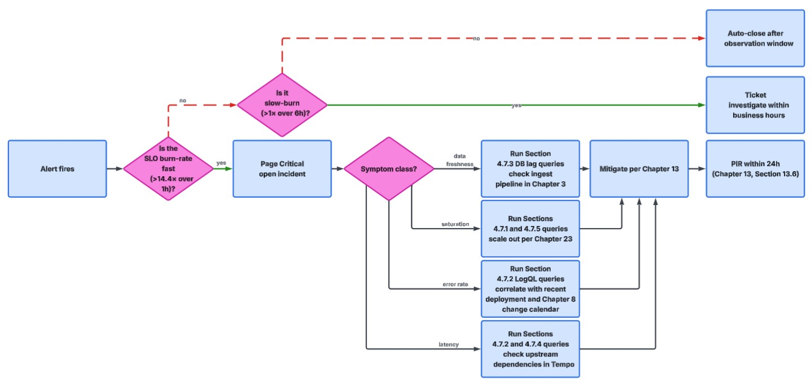
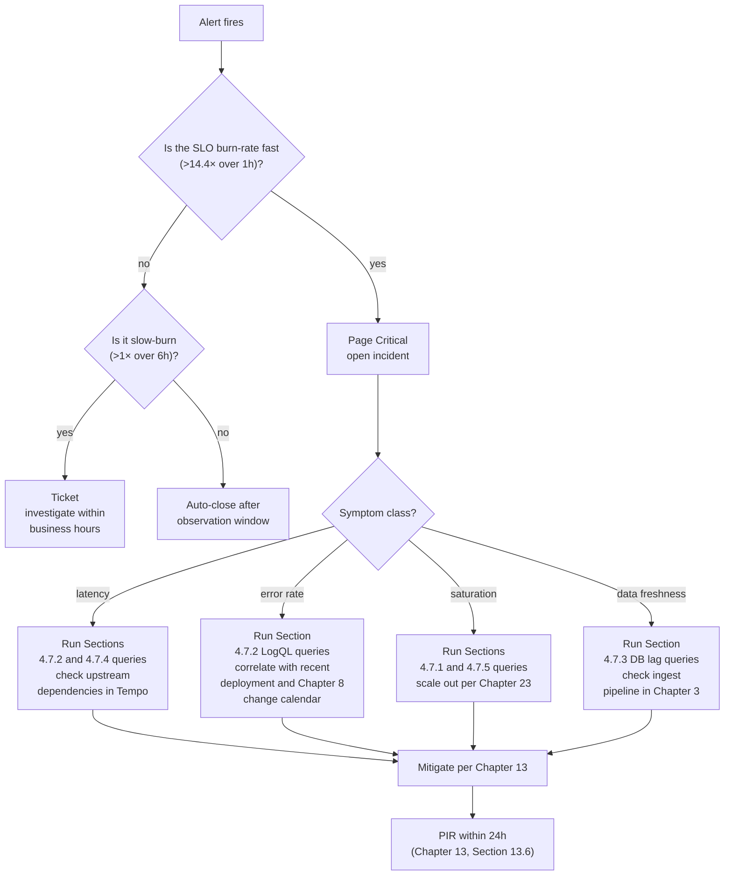
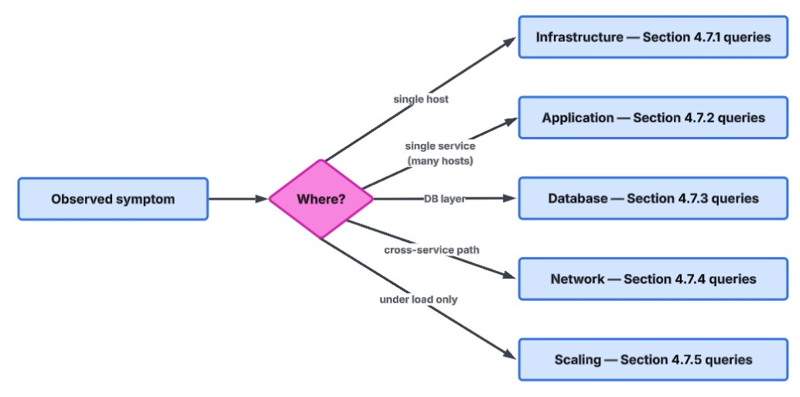
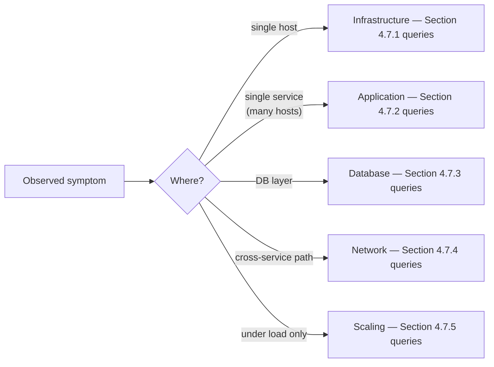

# 4. Domain Observability Runbooks Pack

[↑ Back to TOC](toc.md)

| Version | Owner | Classification | Reviewed Date | Status |
|---|---|---|---|---|
| 0.1 | TBD | Internal |  | Draft |
---

## 4.1 Purpose
Operational runbooks that translate the standards in [2. Enterprise Observability Standards Catalogue](02-enterprise-observability-standards-catalog.md) into day-to-day actions. Each runbook covers signals to watch, what they mean, immediate diagnostics, and remediation. Severities and escalation are governed by [5. Alerting and Incident Severity Policy](05-alerting-and-incident-severity-policy.md). The deployment platform is described in [8. IaC for Observability Standard](08-iac-for-observability-standard.md).

---

## 4.2 Infrastructure Observability Runbook

### 4.2.1 Signals
CPU, memory, disk I/O, container restarts, host failures, Compose service restarts, container start time. Metric thresholds: see [Chapter 2. Enterprise Observability Standards Catalogue -> Section 2.4 Infrastructure Telemetry Standards](02-enterprise-observability-standards-catalog.md#24-infrastructure-telemetry-standards).

### 4.2.2 Triage Flow
1. Confirm scope: per host, per Compose service, per container.
2. Correlate with recent changes (PowerShell deployments, image updates, config rollouts).
3. If sustained > 80% CPU or > 85% memory → investigate runaway workload or resize host.
4. If container restarts > 2/hour → inspect logs (Loki) and `docker compose logs <service>` for OOM / crash loop / config errors.
5. If host failures > 1/day → check hardware / VM-platform health and impact on dependent Compose services.
6. If Compose health-checks failing → run `Test-StackHealth.ps1` and inspect `docker compose ps`.

### 4.2.3 Visualisation
Stacked-area charts and heat maps for trend visibility. Combine gauges (current state) with time-series panels (trend). Per-host and per-service breakdowns required.

---

## 4.3 Application Observability Runbook (Pre-Login & Post-Login Execution Steps)

> Standards and field definitions live in [18. Application Telemetry Standard](18-application-telemetry-standard.md). This runbook covers operational execution.

### 4.3.1 Pre-Login Operational Checks
- **Authentication latency** rising → inspect upstream IdP, API gateway, certificate refresh events.
- **Login failures** elevated → check for credential-system outages, rate limiting, recent auth config changes.
- **MFA failures** elevated → verify third-party MFA provider status; failover to backup if available.
- **API gateway response time** degrading → review upstream service latency and gateway resource saturation.

### 4.3.2 Post-Login Operational Checks
- **Transaction latency** P95 > 800 ms → trace through user-journey spans in Tempo; identify slowest dependency.
- **Service-call failures** rising → inspect retries, timeouts, 5xx counts by service; correlate with deployments.
- **Dependency latency** > 400 ms → check DB, cache, external API health.
- **User-journey success** < 98% → drill into specific journey (login, checkout, report-gen) and isolate failing step.

### 4.3.3 Implementation Tips
- Always track **P95 / P99**, not just averages.
- Correlate signals: high API latency + elevated error rates typically indicates backend or DB issue.

---

## 4.4 Database Observability Runbook

### 4.4.1 Signals
Slow queries, lock contention, connection-pool usage, replication lag, query latency. Thresholds: [Chapter 2. Enterprise Observability Standards Catalogue -> Section 2.7 Database Telemetry Standards](02-enterprise-observability-standards-catalog.md#27-database-telemetry-standards).

### 4.4.2 Triage Flow
1. **Slow queries > 1%** → review query plan, indexes, recent schema changes.
2. **Lock contention > 50 ms avg wait** → review transaction design, long-running transactions, hot rows.
3. **Connection pool > 80%** → check application connection leaks, pool sizing, DB CPU/IO.
4. **Replication lag > 5 s** → check replica health, network between primary/replica, write throughput surge.
5. **P95 query latency > 200 ms** → drill into slowest endpoints/queries, evaluate index coverage and parameter sniffing.

### 4.4.3 Action Expectation
- Warning crosses → investigate within hours; assess resource saturation or query regressions.
- Critical crosses → immediate incident; probable user impact or system instability.

---

## 4.5 Network & Latency Observability Runbook

### 4.5.1 Signals
Packet drops, cross-service latency, DNS failures, inter-service errors, TCP retransmissions. Thresholds: [Chapter 2. Enterprise Observability Standards Catalogue -> Section 2.8 Network & Latency Telemetry Standards](02-enterprise-observability-standards-catalog.md#28-network-latency-telemetry-standards).

### 4.5.2 Triage Flow
1. **Packet drops > 0.5%** sustained → investigate host NIC, route saturation, or link errors.
2. **Cross-service latency P95 > 100 ms** within a site → check network hops, host CPU saturation, or Docker bridge contention.
3. **DNS failures > 0.5%** → validate caching, propagation, resolver health.
4. **Inter-service errors > 1%** → inspect target service health, recent deployments, retry storms; check Compose network reachability between services.
5. **TCP retransmissions > 1%** → congestion or packet loss; user-visible latency likely.

### 4.5.3 Implementation Tips
- **Measure percentiles, not only averages.** Configure alerts on P95 / P99 latency.
- **Correlate signals:**
  - Packet drops + TCP retransmits → physical / host-network congestion issue.
  - Cross-service latency + inter-service errors → dependency or routing problem.
- **Scope:** Collect per host, per Compose service, per container, and per network segment.
- **Visualisation:** Stacked-area charts or heat maps for packet-loss and latency trends.

---

## 4.6 Scaling & Performance Runbook

### 4.6.1 Signals
Queue length, request latency, error rate, container startup time, cold-start latency. Thresholds: [Chapter 2. Enterprise Observability Standards Catalogue -> Section 2.9 Scaling & Performance Telemetry Standards](02-enterprise-observability-standards-catalog.md#29-scaling-performance-telemetry-standards).

### 4.6.2 Outcome Posture
Scaling observability validates that capacity changes deliver the user-visible performance the strategy commits to. Posture: scaling must be **predictable, observable, and tied to user impact**, not internal metrics alone.

### 4.6.3 Implementation Notes
- **Queue length + request latency** together → most effective real-time scaling signals. Both rising → add capacity (scale up the service replica count in Compose, add hosts, or right-size containers); both falling → scale-down opportunity.
- **Error rate + latency spikes** together → service saturation; increase capacity or investigate dependency bottlenecks.
- **Container startup time + cold-start latency** → feed into scaling-lag indicators; track over time to validate that planned capacity changes complete within their SLA window.
- **Percentile-based latency (P95/P99)** with 5-minute moving averages → prevents false alerts caused by short-lived spikes.

### 4.6.4 Triage Flow
1. **Queue > 200 items rising** → capacity change likely needed; review service replica counts and host resource headroom.
2. **P95 latency > 800 ms or P99 > 1 s** → SLA breach risk; correlate with replica count, container CPU/memory, and dependency latency.
3. **Error rate > 1%** sustained → degraded service; combine with latency to detect cascade.
4. **Container startup > 30 s** → image-pull or healthcheck issue; check image size, registry latency, and Compose `healthcheck` definition.
5. **Cold start > 5 s container** → tune image size, pre-pull strategy, or warm-up logic.

---

## 4.7 Query Examples and Decision Trees (Per Domain)

This section provides concrete query examples (PromQL / LogQL / TraceQL) and decision trees for each of the five domain runbooks above. Thresholds are the **pack baseline values** and must be recalibrated per service per [Section 4.8 Calibration Note](#48-calibration-note) once production baselines exist.

### 4.7.1 Infrastructure — PromQL

```promql
# CPU saturation (host) — per-host 5m average
100 - (avg by (instance) (rate(node_cpu_seconds_total{mode="idle"}[5m])) * 100)

# Memory pressure (host)
(1 - (node_memory_MemAvailable_bytes / node_memory_MemTotal_bytes)) * 100

# Disk filling within 24h (linear projection)
predict_linear(node_filesystem_avail_bytes{fstype!~"tmpfs|overlay"}[1h], 24*3600) < 0

# Container OOM kills in last 1h
increase(container_oom_events_total[1h]) > 0
```

### 4.7.2 Application — PromQL + LogQL + TraceQL

```promql
# RED — Rate (req/s) per service+route
sum by (service_name, http_route) (rate(http_server_request_duration_seconds_count[5m]))

# RED — Errors (5xx rate)
sum by (service_name) (rate(http_server_request_duration_seconds_count{http_response_status_code=~"5.."}[5m]))
  /
sum by (service_name) (rate(http_server_request_duration_seconds_count[5m]))

# RED — Duration (p95)
histogram_quantile(0.95,
  sum by (le, service_name, http_route) (rate(http_server_request_duration_seconds_bucket[5m]))
)
```

```logql
# Recent 5xx errors with trace_id, exclude noisy health probes
{service_name="$service"} |~ "(?i)error|exception"
  | json
  | http_response_status_code >= 500
  | http_route != "/healthz"
  | line_format "{{.timestamp}} trace={{.trace_id}} route={{.http_route}} msg={{.body}}"

# Error rate by route over 5m
sum by (http_route) (rate({service_name="$service"} | json | http_response_status_code >= 500 [5m]))
```

```traceql
# Slow spans (>2s) in checkout flow
{ resource.service.name="checkout" && duration > 2s }

# Error traces touching payment gateway
{ resource.service.name="checkout" && span.http.target=~"/api/payment.*" && status=error }
```

### 4.7.3 Database — PromQL

```promql
# Connection-pool utilisation
(db_client_connections_usage{state="used"}
  / db_client_connections_max) * 100

# Slow-query rate (queries > 1s, by db.system)
sum by (db_system, db_name) (rate(db_client_operation_duration_seconds_bucket{le="+Inf"}[5m]))
  -
sum by (db_system, db_name) (rate(db_client_operation_duration_seconds_bucket{le="1.0"}[5m]))

# Replication lag
db_replication_lag_seconds > 30
```

### 4.7.4 Network & Latency — PromQL + LogQL

```promql
# Inter-service p95 latency from RED histogram
histogram_quantile(0.95,
  sum by (le, source_service, dest_service)
    (rate(http_client_request_duration_seconds_bucket[5m]))
)

# TCP retransmits (proxy for network instability)
rate(node_netstat_Tcp_RetransSegs[5m])

# DNS resolution failures
rate(coredns_dns_responses_total{rcode!="NOERROR"}[5m])
```

```logql
# Gateway 502/504 spikes
sum by (upstream) (
  rate({job="gateway"} | json | status >= 502 [5m])
)
```

### 4.7.5 Scaling & Performance — PromQL

```promql
# Saturation — request queue length per service
max by (service_name) (otel_collector_receiver_accepted_spans_total
  - otel_collector_exporter_sent_spans_total)

# Goroutines / threads as growth signal
deriv(process_runtime_go_goroutines[10m]) > 0

# GC pressure
rate(process_runtime_jvm_gc_duration_seconds_sum[5m])
  / rate(process_runtime_jvm_gc_duration_seconds_count[5m])
```

### 4.7.6 Decision Tree — On-Call Triage





### 4.7.7 Decision Tree — Symptom → Runbook Section





## 4.8 Calibration Note
After a few weeks of production data, narrow each range so **Warning ≈ 95th percentile of normal** and **Critical ≈ approaching SLA breach**.

## 4.9 Cross-References
- [2. Enterprise Observability Standards Catalogue](02-enterprise-observability-standards-catalog.md) — metric definitions and threshold catalogue.
- [5. Alerting and Incident Severity Policy](05-alerting-and-incident-severity-policy.md) — severity policy and alert routing.
- [6. Grafana Platform Standard and Visualisation Playbook](06-grafana-platform-standard-and-visualisation-playbook.md) — Grafana dashboard structure.
- [8. IaC for Observability Standard](08-iac-for-observability-standard.md) — deployment standard.
- [13. Incident Response Playbook (Telemetry to Resolution)](13-incident-response-playbook.md) — incident response playbook for end-to-end resolution.

---

[↑ Back to TOC](toc.md)
