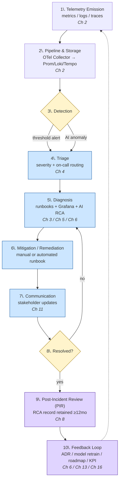

# 13. Incident Response Playbook (Telemetry to Resolution)

[↑ Back to TOC](toc.md)

| Version | Owner | Classification | Reviewed Date | Status |
|---|---|---|---|---|
| 0.2 | TBD | Internal |  | Draft |
---

## 13.1 Purpose
How a telemetry anomaly becomes a diagnosed, communicated, remediated incident. Severities, alert rules, and AI guardrails come from [5. Alerting and Incident Severity Policy](05-alerting-and-incident-severity-policy.md) and [7. AIOps Guardrails and Implementation Playbook](07-aiops-guardrails-and-implementation-playbook.md); runbooks from [4. Domain Observability Runbooks Pack](04-domain-observability-runbooks-pack.md). This playbook integrates them end-to-end.

## 13.2 End-to-End Incident Sequence (Logical Flow)

### 13.2.1 Lifecycle Flow (Mermaid Flowchart)



### 13.2.2 Actor Sequence (Mermaid Sequence Diagram)

```mermaid
sequenceDiagram
    autonumber
    participant Svc as Instrumented Service
    participant Pipe as OTel Collector + Storage
    participant Det as Detection (Alertmanager / AIOps)
    participant OnCall as On-Call Engineer
    participant IC as Incident Commander
    participant SO as Service Owner
    participant Comms as Stakeholders
    participant KB as PIR / Knowledge Base

    Svc->>Pipe: emit metrics / logs / traces
    Pipe->>Det: stream signals
    Det->>OnCall: page (Sev-1) or ticket (Sev-2/3)
    OnCall->>OnCall: acknowledge, open incident
    alt severity = Critical
        OnCall->>IC: engage incident commander
        IC->>Comms: open comms cadence (Ch 4 Sec 6)
    end
    OnCall->>SO: consult runbook + service owner
    SO-->>OnCall: rollback / config / traffic-shift decision
    OnCall->>Pipe: verify mitigation via dashboards (Ch 5)
    Pipe-->>OnCall: signals returning to healthy ranges
    OnCall->>Comms: resolution announcement
    OnCall->>KB: open PIR draft within 24h
    KB->>KB: structured RCA record (Ch 8 retention)
    KB-->>IC: PIR reviewed; corrective actions assigned
    IC-->>SO: track never-repeat items (Ch 16 ADR if systemic)
```

### 13.2.3 Step-by-Step Description

| # | Step | Owner | Cross-Reference |
|---|---|---|---|
| 1 | Telemetry emission from instrumented services | Service Owner | [3. Observability Reference Architecture](03-observability-reference-architecture.md) |
| 2 | Pipeline & storage (OTel Collector → Prom/Loki/Tempo) | Platform | [3. Observability Reference Architecture](03-observability-reference-architecture.md) |
| 3 | Detection (threshold or AI anomaly) | Platform | [5. Alerting and Incident Severity Policy](05-alerting-and-incident-severity-policy.md), [7. AIOps Guardrails and Implementation Playbook](07-aiops-guardrails-and-implementation-playbook.md) |
| 4 | Triage — severity, ack, routing | On-Call | [5. Alerting and Incident Severity Policy](05-alerting-and-incident-severity-policy.md) |
| 5 | Diagnosis via runbooks + Grafana + AI RCA | On-Call + Service Owner | [4. Domain Observability Runbooks Pack](04-domain-observability-runbooks-pack.md), [6. Grafana Platform Standard and Visualisation Playbook](06-grafana-platform-standard-and-visualisation-playbook.md), [7. AIOps Guardrails and Implementation Playbook](07-aiops-guardrails-and-implementation-playbook.md) |
| 6 | Mitigation / remediation | Service Owner | [4. Domain Observability Runbooks Pack](04-domain-observability-runbooks-pack.md) |
| 7 | Communication to stakeholders | Incident Commander | [12. Observability KPI Scorecard](12-observability-kpi-scorecard.md) |
| 8 | Resolution & verification (metrics healthy, alerts auto-resolve) | On-Call | [6. Grafana Platform Standard and Visualisation Playbook](06-grafana-platform-standard-and-visualisation-playbook.md) |
| 9 | Post-Incident Review (PIR) — structured RCA record | Incident Commander | [9. Observability Data Governance and Retention Policy](09-observability-data-governance-and-retention-policy.md) |
| 10 | Feedback — ADR, model retraining, roadmap, KPI updates | Governance Body | [7. AIOps Guardrails and Implementation Playbook](07-aiops-guardrails-and-implementation-playbook.md), [14. Observability Roadmap Delivery Plan](14-observability-roadmap-delivery-plan.md), [17. Observability ADR Decision Register](17-observability-adr-decision-register.md) |

## 13.3 Roles
| Role | Responsibility |
|---|---|
| On-Call Engineer | First responder; triage, diagnosis, communication. |
| Incident Commander | Coordinates response for Critical incidents; owns comms cadence. |
| SRE / Platform Ops | Owns runbook execution and platform-level remediation. |
| Service Owner | Owns service-specific decisions (rollback, traffic shifting). |
| Governance Body | Reviews PIR outcomes; ratifies systemic changes ([16. Observability Governance Charter and ARB Pack](16-observability-governance-charter-and-arb-pack.md)). |

## 13.4 Incident Severity Mapping
Inherited from [Chapter 5. Alerting and Incident Severity Policy -> Section 5.3 Standard Severity Model](05-alerting-and-incident-severity-policy.md#53-standard-severity-model):

| Severity | Response | Comms |
|---|---|---|
| Info / Tracking | Trend logged; no action | None |
| Warning | Investigated within business hours | Internal channel post |
| Critical | Page on-call immediately; commander engaged | Stakeholder updates per cadence |

## 13.5 Diagnosis Aids
- **Grafana correlation panels** — dashboards link metrics ↔ logs ↔ traces via shared identifiers (see [6. Grafana Platform Standard and Visualisation Playbook](06-grafana-platform-standard-and-visualisation-playbook.md)).
- **AI-generated RCA tickets** — pre-populated with context, impact assessment, and suggested remediation (see [7. AIOps Guardrails and Implementation Playbook](07-aiops-guardrails-and-implementation-playbook.md)).
- **Domain runbooks** — see [4. Domain Observability Runbooks Pack](04-domain-observability-runbooks-pack.md) for infra, application, DB, network, scaling.

## 13.6 Post-Incident Review (PIR)
For each major incident, a structured RCA record is captured with:
- Timeline of detection → mitigation → resolution.
- Customer / business impact (revenue, sessions, SLA).
- Root cause and contributing factors.
- Corrective actions and **never-repeat** items.

PIRs are stored in a central knowledge base for **at least 12 months** (per [Chapter 9. Observability Data Governance and Retention Policy -> Section 9.4 Worked Example: Applying Retention Policy](09-observability-data-governance-and-retention-policy.md#94-worked-example-applying-retention-policy)).

### 13.6.1 Integration with ITSM and Change Tooling

- Incidents are tracked in the enterprise ITSM tool (for example, ServiceNow or Jira) with fields mapped as follows:
  - `severity` ↔ severity model in [5. Alerting and Incident Severity Policy](05-alerting-and-incident-severity-policy.md).
  - `service` ↔ `service.name`.
  - `environment` ↔ `deployment.environment`.
  - `slo_breach` (boolean) and `slo_reference` (link to SLO definition) where applicable.
- Incident creation is automated for Critical alerts; ticket IDs are linked back into Grafana panels and AIOps outputs.
- Change records (for example, deployment tickets) are linked to incidents during PIR so that systemic fixes can be tracked through the change calendar in [8. IaC for Observability Standard](08-iac-for-observability-standard.md).

## 13.7 Success Criteria
- MTTD reduced per phase targets (see [12. Observability KPI Scorecard](12-observability-kpi-scorecard.md) / [15. Observability Capability Assessment Framework](15-observability-capability-assessment-framework.md)).
- ≥ 90% incidents have an identified root cause.
- > 90% automated ticket creation by Phase 3 maturity.
- Demonstrable reuse of PIR records in subsequent reviews and risk assessments.

### 13.7.1 Closed-Loop Improvement

Each PIR explicitly identifies whether updates are required to any of the following and tracks them to completion:
- **Runbooks:** new steps, clarified diagnostics, or new branches in decision trees (Chapter 4).
- **SLOs and alerts:** thresholds tuned, new SLOs added, or obsolete alerts retired (Chapters 2, 5, 25).
- **Dashboards:** new panels or views required to detect or diagnose similar incidents faster (Chapter 6).
- **Instrumentation:** telemetry field additions or corrections (Chapters 18 and 20).

Where the corrective action is systemic (affects multiple services or platform-wide behaviour), the PIR nominates an ADR in [17. Observability ADR Decision Register](17-observability-adr-decision-register.md) and, if needed, a roadmap item in [14. Observability Roadmap Delivery Plan](14-observability-roadmap-delivery-plan.md).

## 13.8 Cross-References
- [4. Domain Observability Runbooks Pack](04-domain-observability-runbooks-pack.md) — domain runbooks.
- [5. Alerting and Incident Severity Policy](05-alerting-and-incident-severity-policy.md) — severity policy & routing.
- [6. Grafana Platform Standard and Visualisation Playbook](06-grafana-platform-standard-and-visualisation-playbook.md) — Grafana correlation tooling.
- [7. AIOps Guardrails and Implementation Playbook](07-aiops-guardrails-and-implementation-playbook.md) — AI RCA & automated ticketing.
- [12. Observability KPI Scorecard](12-observability-kpi-scorecard.md) — incident-related KPIs.
- [14. Observability Roadmap Delivery Plan](14-observability-roadmap-delivery-plan.md) — phase-aligned automation roadmap.
- [17. Observability ADR Decision Register](17-observability-adr-decision-register.md) — decision register for systemic incident-driven changes.

---

[↑ Back to TOC](toc.md)
