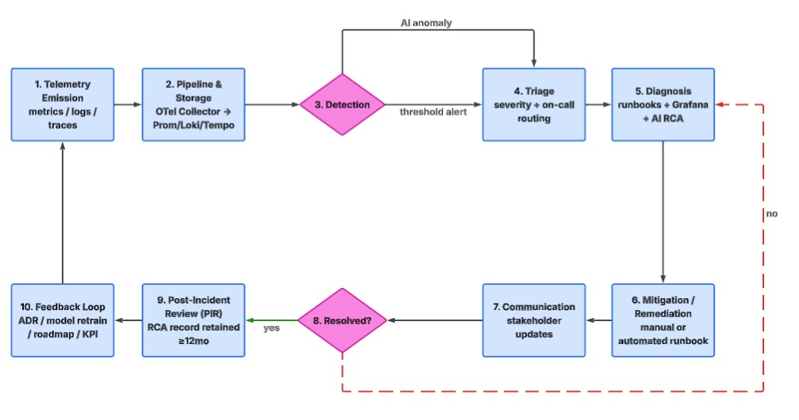
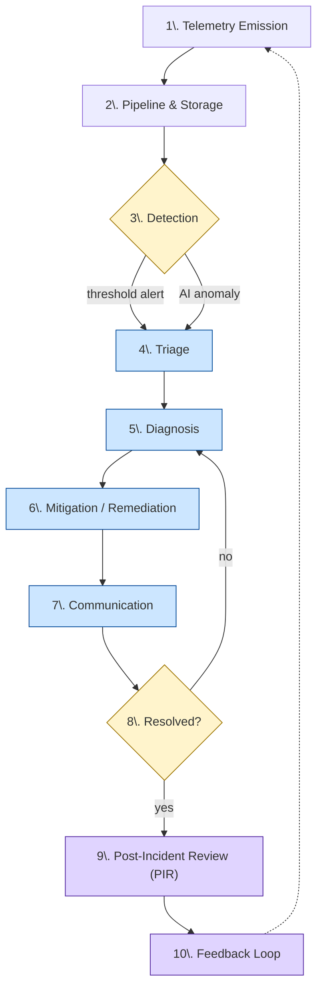
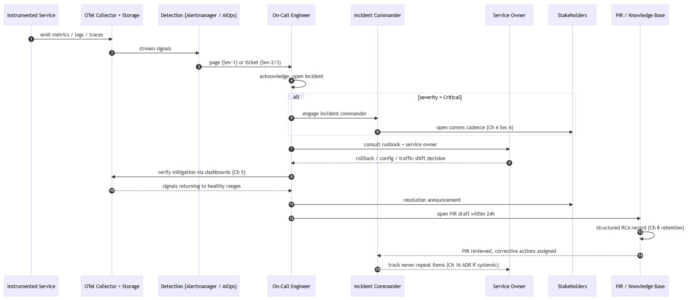
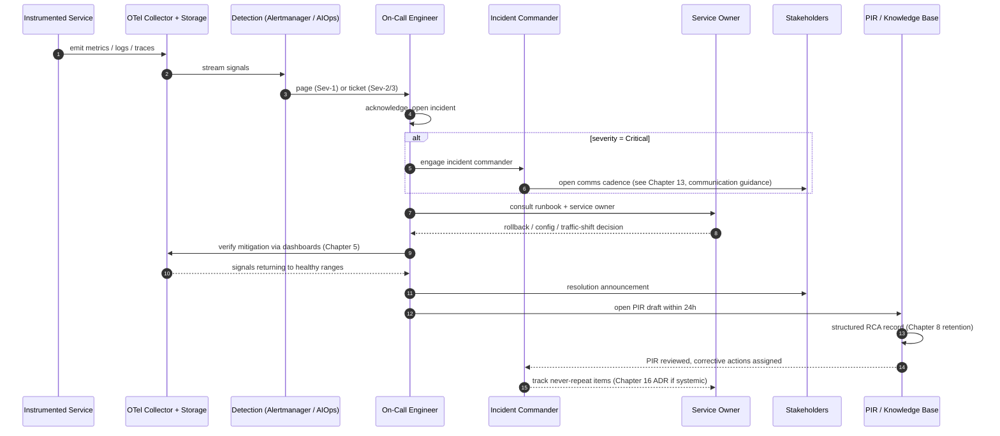

# 13. Incident Response Playbook (Telemetry to Resolution)

[Home Page](01-xceedance-observability-strategy.md) | [Previous Page](12-observability-kpi-scorecard.md) | [Next Page](14-observability-roadmap-delivery-plan.md)

| **Document Owner** | CoE-Architecture |
| --- | --- |
| **Approved By** | Simon Armstrong (pending wider review) |
| **Classification** | Internal |
| **Review Frequency** | Quarterly |
| **First Review** | 1-Aug-2026 |
| **Next Review Due** | 1-Nov-2026 |

---

## 13.0 Reader Guide
Use this chapter when an alert becomes an incident. On-call engineers should follow the flow from detection through mitigation; incident commanders should focus on coordination, communication, PIR, and feedback-loop responsibilities.

## 13.1 Purpose
How a telemetry anomaly becomes a diagnosed, communicated, remediated incident. Severities, alert rules, and AI guardrails come from [Chapter 5. Alerting and Incident Severity Policy](05-alerting-and-incident-severity-policy.md) and [Chapter 7. AIOps Guardrails and Implementation Playbook](07-aiops-guardrails-and-implementation-playbook.md); runbooks from [Chapter 4. Domain Observability Runbooks Pack](04-domain-observability-runbooks-pack.md). This playbook integrates them end-to-end.

## 13.2 End-to-End Incident Sequence (Logical Flow)

### 13.2.1 Lifecycle Flow (Mermaid Flowchart)

**Diagram legend:**
- **Step 1–2 (Telemetry Emission, Pipeline & Storage):** see Chapter 3 (Observability Reference Architecture).
- **Step 3–4 (Detection, Triage):** see Chapter 5 (Alerting and Incident Severity Policy) and Chapter 7 (AIOps Guardrails and Implementation Playbook).
- **Step 5–6 (Diagnosis, Mitigation):** see Chapter 4 (Domain Observability Runbooks Pack) and Chapter 6 (Grafana Platform Standard and Visualisation Playbook).
- **Step 7 (Communication):** see Chapter 12 (Observability KPI Scorecard) for reporting; Chapter 16 (Governance) for escalation.
- **Step 9 (PIR):** see Chapter 9 (Observability Data Governance and Retention Policy) for RCA retention.
- **Step 10 (Feedback Loop):** see Chapter 7 (AIOps), Chapter 14 (Roadmap), and Chapter 17 (ADR Decision Register).

### 13.2.2 Actor Sequence (Mermaid Sequence Diagram)

### 13.2.3 Step-by-Step Description

| # | Step | Owner | Cross-Reference |
|---|---|---|---|
| 1 | Telemetry emission from instrumented services | Service Owner | [Chapter 3. Observability Reference Architecture](03-observability-reference-architecture.md) |
| 2 | Pipeline & storage (OTel Collector → Prom/Loki/Tempo) | Platform | [Chapter 3. Observability Reference Architecture](03-observability-reference-architecture.md) |
| 3 | Detection (threshold or AI anomaly) | Platform | [Chapter 5. Alerting and Incident Severity Policy](05-alerting-and-incident-severity-policy.md), [Chapter 7. AIOps Guardrails and Implementation Playbook](07-aiops-guardrails-and-implementation-playbook.md) |
| 4 | Triage — severity, ack, routing | On-Call | [Chapter 5. Alerting and Incident Severity Policy](05-alerting-and-incident-severity-policy.md) |
| 5 | Diagnosis via runbooks + Grafana + AI RCA | On-Call + Service Owner | [Chapter 4. Domain Observability Runbooks Pack](04-domain-observability-runbooks-pack.md), [Chapter 6. Grafana Platform Standard and Visualisation Playbook](06-grafana-platform-standard-and-visualisation-playbook.md), [Chapter 7. AIOps Guardrails and Implementation Playbook](07-aiops-guardrails-and-implementation-playbook.md) |
| 6 | Mitigation / remediation | Service Owner | [Chapter 4. Domain Observability Runbooks Pack](04-domain-observability-runbooks-pack.md) |
| 7 | Communication to stakeholders | Incident Commander | [Chapter 12. Observability KPI Scorecard](12-observability-kpi-scorecard.md) |
| 8 | Resolution & verification (metrics healthy, alerts auto-resolve) | On-Call | [Chapter 6. Grafana Platform Standard and Visualisation Playbook](06-grafana-platform-standard-and-visualisation-playbook.md) |
| 9 | Post-Incident Review (PIR) — structured RCA record | Incident Commander | [Chapter 9. Observability Data Governance and Retention Policy](09-observability-data-governance-and-retention-policy.md) |
| 10 | Feedback — ADR, model retraining, roadmap, KPI updates | Governance Body | [Chapter 7. AIOps Guardrails and Implementation Playbook](07-aiops-guardrails-and-implementation-playbook.md), [Chapter 14. Observability Roadmap Delivery Plan](14-observability-roadmap-delivery-plan.md), [Chapter 17. Observability ADR Decision Register](17-observability-adr-decision-register.md) |

## 13.3 Roles
| Role | Responsibility |
|---|---|
| On-Call Engineer | First responder; triage, diagnosis, communication. |
| Incident Commander | Coordinates response for Critical incidents; owns comms cadence. |
| SRE / Platform Ops | Owns runbook execution and platform-level remediation. |
| Service Owner | Owns service-specific decisions (rollback, traffic shifting). |
| Governance Body | Reviews PIR outcomes; ratifies systemic changes ([Chapter 16. Observability Governance Charter and ARB Pack](16-observability-governance-charter-and-arb-pack.md)). |

## 13.4 Incident Severity Mapping
Inherited from [Chapter 5. Alerting and Incident Severity Policy -> Section 5.3 Standard Severity Model](05-alerting-and-incident-severity-policy.md#53-standard-severity-model):

| Severity | Response | Comms |
|---|---|---|
| Info / Tracking | Trend logged; no action | None |
| Warning | Investigated within business hours | Internal channel post |
| Critical | Page on-call immediately; commander engaged | Stakeholder updates per cadence |

## 13.5 Diagnosis Aids
- **Grafana correlation panels** — dashboards link metrics ↔ logs ↔ traces via shared identifiers (see [Chapter 6. Grafana Platform Standard and Visualisation Playbook](06-grafana-platform-standard-and-visualisation-playbook.md)).
- **AI-generated RCA tickets** — pre-populated with context, impact assessment, and suggested remediation (see [Chapter 7. AIOps Guardrails and Implementation Playbook](07-aiops-guardrails-and-implementation-playbook.md)).
- **Domain runbooks** — see [Chapter 4. Domain Observability Runbooks Pack](04-domain-observability-runbooks-pack.md) for infra, application, DB, network, scaling.

## 13.6 Post-Incident Review (PIR)
For each major incident, a structured RCA record is captured with:
- Timeline of detection → mitigation → resolution.
- Customer / business impact (revenue, sessions, SLA).
- Root cause and contributing factors.
- Corrective actions and **never-repeat** items.

PIRs are stored in a central knowledge base for **at least 12 months** (per [Chapter 9. Observability Data Governance and Retention Policy -> Section 9.4 Worked Example: Applying Retention Policy](09-observability-data-governance-and-retention-policy.md#94-worked-example-applying-retention-policy)).

### 13.6.1 Integration with ITSM and Change Tooling

- Incidents are tracked in the enterprise ITSM tool (for example, ServiceNow or Jira) with fields mapped as follows:
  - `severity` ↔ severity model in [Chapter 5. Alerting and Incident Severity Policy](05-alerting-and-incident-severity-policy.md).
  - `service` ↔ `service.name`.
  - `environment` ↔ `deployment.environment`.
  - `slo_breach` (boolean) and `slo_reference` (link to SLO definition) where applicable.
- Incident creation is automated for Critical alerts; ticket IDs are linked back into Grafana panels and AIOps outputs.
- Change records (for example, deployment tickets) are linked to incidents during PIR so that systemic fixes can be tracked through the change calendar in [Chapter 8. IaC for Observability Standard](08-iac-for-observability-standard.md).

## 13.7 Success Criteria
- MTTD reduced per phase targets (see [Chapter 12. Observability KPI Scorecard](12-observability-kpi-scorecard.md) / [Chapter 15. Observability Capability Assessment Framework](15-observability-capability-assessment-framework.md)).
- ≥ 90% incidents have an identified root cause.
- > 90% automated ticket creation by Phase 3 maturity.
- Demonstrable reuse of PIR records in subsequent reviews and risk assessments.

### 13.7.1 Closed-Loop Improvement

Each PIR explicitly identifies whether updates are required to any of the following and tracks them to completion:
- **Runbooks:** new steps, clarified diagnostics, or new branches in decision trees (Chapter 4).
- **SLOs and alerts:** thresholds tuned, new SLOs added, or obsolete alerts retired (Chapters 2, 5, 25).
- **Dashboards:** new panels or views required to detect or diagnose similar incidents faster (Chapter 6).
- **Instrumentation:** telemetry field additions or corrections (Chapters 18 and 20).

Where the corrective action is systemic (affects multiple services or platform-wide behaviour), the PIR nominates an ADR in [Chapter 17. Observability ADR Decision Register](17-observability-adr-decision-register.md) and, if needed, a roadmap item in [Chapter 14. Observability Roadmap Delivery Plan](14-observability-roadmap-delivery-plan.md).

## 13.8 Cross-References
- [Chapter 4. Domain Observability Runbooks Pack](04-domain-observability-runbooks-pack.md) — domain runbooks.
- [Chapter 5. Alerting and Incident Severity Policy](05-alerting-and-incident-severity-policy.md) — severity policy & routing.
- [Chapter 6. Grafana Platform Standard and Visualisation Playbook](06-grafana-platform-standard-and-visualisation-playbook.md) — Grafana correlation tooling.
- [Chapter 7. AIOps Guardrails and Implementation Playbook](07-aiops-guardrails-and-implementation-playbook.md) — AI RCA & automated ticketing.
- [Chapter 12. Observability KPI Scorecard](12-observability-kpi-scorecard.md) — incident-related KPIs.
- [Chapter 14. Observability Roadmap Delivery Plan](14-observability-roadmap-delivery-plan.md) — phase-aligned automation roadmap.
- [Chapter 17. Observability ADR Decision Register](17-observability-adr-decision-register.md) — decision register for systemic incident-driven changes.

---

[Home Page](01-xceedance-observability-strategy.md) | [Previous Page](12-observability-kpi-scorecard.md) | [Next Page](14-observability-roadmap-delivery-plan.md)
