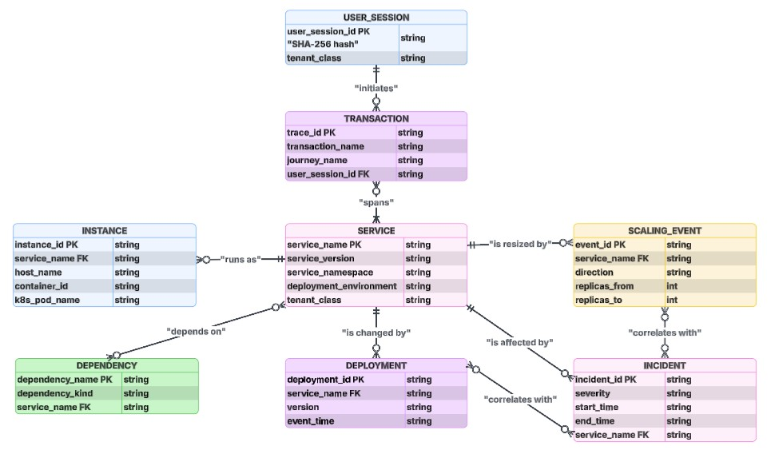
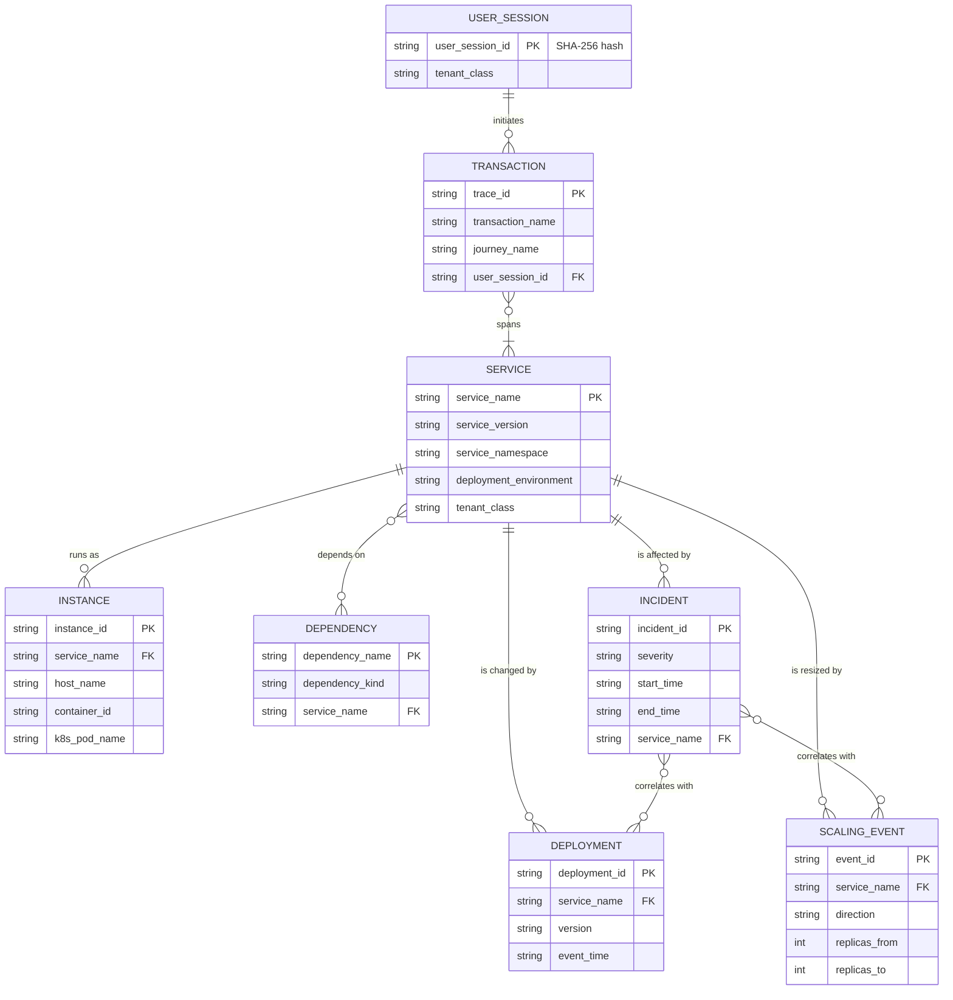

# 20. Observability Data Model Specification

[Home Page](01-xceedance-observability-strategy.md) | [Previous Page](19-observability-operating-model-and-adoption-plan.md) | [Next Page](21-business-capability-and-value-stream-mapping.md)

| **Document Owner** | CoE-Architecture |
| --- | --- |
| **Approved By** | Simon Armstrong (pending wider review) |
| **Classification** | Internal |
| **Review Frequency** | Quarterly |
| **First Review** | 1-Aug-2026 |
| **Next Review Due** | 1-Nov-2026 |

---

## 20.0 Reader Guide
Use this chapter when defining or validating telemetry schemas. Platform implementors and schema owners should focus on entities, resource attributes, schema versioning, and dead-letter handling; service teams should use it to understand which attributes their telemetry must populate.

## 20.1 Purpose
Define the formal data model for the observability platform: telemetry signal types, the entities they describe, their relationships, and schema conventions enabling cross-pillar correlation.

**Why this matters.** This chapter is primarily for **platform implementors and schema owners**. It defines the fields and relationships that must exist so that metrics, logs, traces, and events can be joined reliably. Service teams usually only need to know which attributes to populate; platform teams and data-governance owners use this model to validate schemas, enforce consistency, and power higher-level features like Telemetry Health and DLQ handling.

## 20.2 Telemetry Signal Types

| Signal | Tool | Purpose |
|---|---|---|
| Metrics | Prometheus | Quantitative health checks; numerical time series |
| Logs | Loki | Discrete event records with narrative context |
| Traces | Tempo | End-to-end request journey across distributed services |
| Events | OpenTelemetry | Discrete occurrences (deployments, scaling, config changes) |
| Profiles | Pyroscope | Stack-trace / code-level performance |

Together these form **full-stack observability**.

## 20.3 Core Entities (Initial Inventory)

| Entity | Description | Key Attributes |
|---|---|---|
| Service | A deployable unit emitting telemetry | `service.name`, `service.version`, `env`, `cloud`, `region` |
| Instance | Running container of a service | `instance.id`, `host`, `container.id`, `container.name` |
| Dependency | External or internal target a service calls | `dependency.name`, `dependency.kind` (db / cache / http / queue) |
| User Session | Authenticated user session (tokenised) | `user.session.id` (hashed), `tenant_class` |
| Transaction | End-to-end user action (root span) | `transaction.name`, `journey.name`, `correlation.id` |
| Incident | A production issue with timeline & impact | `incident.id`, `severity`, `start`, `end`, `service` |
| Deployment | A change event | `deployment.id`, `service`, `version`, `timestamp` |
| Scaling Event | Autoscaler action | `event.id`, `service`, `direction`, `replicas.from/to` |

## 20.4 Relationships (Logical)
- **Service** *has many* **Instances**.
- **Service** *depends on* **Service / Dependency** (forms the dependency graph).
- **Transaction** *spans* multiple **Services** (root span + child spans).
- **Incident** *affects* one or more **Services** and *correlates with* **Deployments** / **Scaling Events**.
- **User Session** *initiates* **Transactions**.

## 20.5 Correlation Identifiers
- `trace.id` — the technical distributed-tracing identifier carried by W3C Trace Context and required across traces, logs, and metric exemplars.
- `correlation.id` — the business correlation identifier that must survive non-tracing hops such as queues, batch jobs, partner callbacks, and manual replays.
- `service.name` + `env` — primary partition keys for cross-pillar joins.
- `tenant_class` — for multi-tenant grouping (no tenant PII).

## 20.6 Schema Conventions
- Follow **OpenTelemetry semantic conventions** where available.
- Custom attributes prefixed with `xc.` (Xceedance) namespace to avoid collision.
- Metric names follow the enterprise snake_case standard in [Chapter 18. Application Telemetry Standard -> Section 18.5 Naming Conventions](18-application-telemetry-standard.md#185-naming-conventions) and [Chapter 2. Enterprise Observability Standards Catalogue -> Section 2.3 Naming and Labelling Standards](02-enterprise-observability-standards-catalog.md#23-naming-and-labelling-standards).
- Labels: bounded cardinality; high-cardinality labels removed/bucketed after retention window (see [Chapter 9. Observability Data Governance and Retention Policy -> Section 9.6 Data Quality and Standards](09-observability-data-governance-and-retention-policy.md#96-data-quality-and-standards), [Chapter 10. Observability FinOps Standard -> Section 10.3 Down-Sampling and Aggregation](10-observability-finops-standard.md#103-down-sampling-and-aggregation)).

### 20.6.1 Telemetry Schema Versioning
- Each telemetry schema (metrics, logs, traces, events, profiles) carries an explicit **schema version** in metadata (for example, `xc.schema_version` tag or `$id` path in JSON schema).
- **Breaking changes** (removing fields, changing type or meaning) require a new **major** schema version and a migration plan:
  - Producers MAY emit either version for a minimum **90-day overlap window**.
  - Consumers must be tolerant of both versions during overlap.
  - Breaking changes must be justified in an ADR and approved per [Chapter 16. Observability Governance Charter and ARB Pack](16-observability-governance-charter-and-arb-pack.md).
- **Non-breaking changes** (adding optional fields, extending enums) are allowed within the same major version but MUST be backwards-compatible for all consumers.
- Deprecation of fields is documented in the schema file and PIRs/ADRs reference the deprecation where relevant.

## 20.7 PII & Sensitive Data
PII is prohibited in logs and traces wherever possible. Masking, tokenisation, or redaction is enforced at source or in the pipeline (see [Chapter 9. Observability Data Governance and Retention Policy -> Section 9.5 Data Classification](09-observability-data-governance-and-retention-policy.md#95-data-classification)).

## 20.8 Telemetry Health and Data-Quality Monitoring

Healthy telemetry is a **first-class SLI**. The platform continuously monitors for signs of broken or degraded instrumentation.

### 20.8.1 Broken-Instrumentation Heuristics

The following heuristics are implemented as recording rules and alerts:

- **Stuck gauges:**
  - `delta(metric[15m]) == 0` for gauges expected to change (queue depth, memory usage) → potential stuck exporter.
- **Flat counters:**
  - Counters (`*_total`) that show zero increase over a configurable window despite non-zero traffic (e.g. HTTP request counter flat while latency metrics move) → missing increments or label misconfiguration.
- **Sudden cardinality drop:**
  - Active series per service or label cardinality drops > 50% in 5 minutes without a corresponding deployment event → potential label loss.
- **Timestamp skew:**
  - Metric or log timestamps outside ±5 minutes of wall-clock → clock drift or bad timestamp wiring.
- **Trace coverage:**
  - Expected trace coverage SLI (e.g. percentage of HTTP requests with a trace) falls below agreed threshold per tier.

These heuristics feed into a **Telemetry Health** view rather than paging on-call immediately; paging thresholds are defined in [Chapter 5. Alerting and Incident Severity Policy](05-alerting-and-incident-severity-policy.md).

### 20.8.2 Telemetry Health Dashboard Standard

Every environment has a standardised "Telemetry Health" dashboard with at least the following panels:

- **Signal coverage:** per service, proportion of requests with metrics, logs, and traces.
- **Schema validity:** rate of schema-validation failures per signal type (see Section 20.9.6 **Dead-Letter Discipline for Schema Violations**).
- **Cardinality vs budget:** active series and label-cardinality versus budgets from [Chapter 2. Enterprise Observability Standards Catalogue -> Section 2.3.4 Cardinality Governance](02-enterprise-observability-standards-catalog.md#234-cardinality-governance).
- **Timestamp skew:** distribution of ingest- vs event-time deltas.
- **PII violations:** count of records routed to the `dlq-pii` stream.

The dashboard template lives alongside other platform dashboards in [Chapter 6. Grafana Platform Standard and Visualisation Playbook](06-grafana-platform-standard-and-visualisation-playbook.md) and is generated per environment.

## 20.9 Canonical JSON Schemas, ERD, and OTel Crosswalk

This section turns the logical model in Sections 2–7 into concrete, machine-validatable artefacts: a per-signal JSON Schema, an entity relationship diagram for the correlation entities, an OpenTelemetry semantic-convention crosswalk, and the dead-letter discipline that protects downstream consumers from malformed data.

### 20.9.1 JSON Schema Index

Five canonical schemas live under `schemas/`. Each schema is the source-of-truth contract between producers (services, collectors) and consumers (backends, correlation engine, AIOps models). Producers MUST validate locally before emission; the ingest pipeline re-validates and routes failures to the dead-letter stream described in Section 20.8.6.

| Signal | Schema file | `$id` | Aligned With |
|---|---|---|---|
| Metrics  | `schemas/metric-sample.schema.json`  | `.../metric-sample.schema.json`  | OpenTelemetry Metrics data model; Prometheus exposition |
| Logs     | `schemas/log-record.schema.json`     | `.../log-record.schema.json`     | OpenTelemetry Logs data model; ECS where compatible |
| Traces   | `schemas/trace-span.schema.json`     | `.../trace-span.schema.json`     | OpenTelemetry Traces data model; W3C Trace Context |
| Events   | `schemas/event-record.schema.json`   | `.../event-record.schema.json`   | CloudEvents 1.0 (envelope semantics, not literal layout) |
| Profiles | `schemas/profile-sample.schema.json` | `.../profile-sample.schema.json` | pprof; OpenTelemetry profiling signal (development) |

All schemas use **JSON Schema Draft 2020-12**. Cross-schema references (e.g. the shared `resource` definition) use relative `$ref` so the schemas are portable as a single bundle.

### 20.9.2 Required Resource Attributes (All Signals)

The `resource` definition in `metric-sample.schema.json#/$defs/resource` is the **single source of truth** for the resource block on every signal. It enforces three required attributes — `service.name`, `service.version`, `deployment.environment` — because these three form the partition key for every cross-pillar join in [Chapter 7. AIOps Guardrails and Implementation Playbook -> Section 7.3 Interpreting the AI-Driven Metrics](07-aiops-guardrails-and-implementation-playbook.md#73-interpreting-the-ai-driven-metrics).

### 20.9.3 Schema Version Lifecycle

- Schemas are versioned via the `$id` URL path (e.g. `/schemas/v1/metric-sample.schema.json` when v2 lands).
- Breaking changes require a new major version and a 90-day overlap window during which producers MAY emit either version.
- Additive changes (new optional fields, new enum members) are non-breaking and ship as minor revisions; the `$id` is unchanged but the schema file carries a `revision` annotation.
- Schema changes follow the change-control process in [Chapter 16. Observability Governance Charter and ARB Pack -> Section 16.3 Decision Rights](16-observability-governance-charter-and-arb-pack.md#163-decision-rights).

### 20.9.4 Entity Relationship Diagram

The diagram below renders the entities and relationships from Sections 3 and 4 in their formal cardinality. It is the canonical reference for the correlation model in [Chapter 7. AIOps Guardrails and Implementation Playbook -> Section 7.3 Interpreting the AI-Driven Metrics](07-aiops-guardrails-and-implementation-playbook.md#73-interpreting-the-ai-driven-metrics).

Notes on cardinality:

- A **Service** has zero-or-many **Instances** at any moment (autoscaling, blue/green).
- A **Service** depends on zero-or-many **Dependencies** and is depended upon by zero-or-many other Services (the dependency graph derived from span `parent`/`child` relationships per [Chapter 18. Application Telemetry Standard -> Section 18.4 Post-Login Telemetry (Required Fields & Standards)](18-application-telemetry-standard.md#184-post-login-telemetry-required-fields-standards)).
- A **Transaction** spans one-or-many **Services** (root + child spans); a Service participates in zero-or-many concurrent Transactions.
- An **Incident** correlates with zero-or-many **Deployments** and **Scaling Events** within its detection window (default ±30 min, governed by [Chapter 7. AIOps Guardrails and Implementation Playbook -> Section 7.4 Severity Policy for AI-Detected Events](07-aiops-guardrails-and-implementation-playbook.md#74-severity-policy-for-ai-detected-events)).

### 20.9.5 OpenTelemetry Semantic-Convention Crosswalk

The schemas reuse OpenTelemetry semantic-convention attribute names verbatim wherever a convention exists; Xceedance-specific attributes are namespaced `xc.*`. This table is the audit trail for every attribute used in the schemas of Section 20.8.1.

| Logical Concept (Section 4) | Schema Field | OTel Convention | Notes |
|---|---|---|---|
| Service name              | `resource.service.name`           | `service.name`           | Required on every signal. |
| Service version           | `resource.service.version`        | `service.version`        | Required; sourced from build pipeline. |
| Environment               | `resource.deployment.environment` | `deployment.environment` | Enum `prod\|staging\|uat\|dev`. |
| Cloud provider            | `resource.cloud.provider`         | `cloud.provider`         | Enum `aws\|azure\|gcp\|onprem`. |
| Cloud region              | `resource.cloud.region`           | `cloud.region`           | |
| Host name                 | `resource.host.name`              | `host.name`              | |
| Container id              | `resource.container.id`           | `container.id`           | |
| Kubernetes namespace      | `resource.k8s.namespace.name`     | `k8s.namespace.name`     | |
| Kubernetes pod            | `resource.k8s.pod.name`           | `k8s.pod.name`           | |
| Tenant grouping           | `resource.tenant_class`           | *Xceedance extension*    | Bucketed class only; no tenant PII. |
| HTTP request method       | `attributes.http.request.method`  | `http.request.method`    | Enum-restricted. |
| HTTP response status      | `attributes.http.response.status_code` | `http.response.status_code` | 100–599. |
| HTTP route (low-cardinality) | `attributes.http.route`        | `http.route`             | Parameterised path, never raw URL. |
| URL scheme                | `attributes.url.scheme`           | `url.scheme`             | |
| Server address / port     | `attributes.server.address`, `attributes.server.port` | `server.address`, `server.port` | |
| Database system           | `attributes.db.system`            | `db.system`              | E.g. `postgresql`, `mssql`, `redis`. |
| Database operation        | `attributes.db.operation.name`    | `db.operation.name`      | E.g. `SELECT`, `INSERT`. |
| Messaging system          | `attributes.messaging.system`     | `messaging.system`       | E.g. `kafka`, `rabbitmq`. |
| Messaging destination     | `attributes.messaging.destination.name` | `messaging.destination.name` | |
| RPC system / service / method | `attributes.rpc.system/service/method` | `rpc.system/service/method` | |
| Error type / message / stack | `attributes.error.{type,message,stack_trace}` | `error.type`, `exception.message`, `exception.stacktrace` | Logs use `error.*`; spans MAY use `exception.*` events. |
| Trace correlation         | `trace_id`, `span_id`             | W3C Trace Context        | Lowercase hex; 32/16 chars. |
| Named user journey        | `attributes.transaction.name`, `attributes.journey.name` | *Xceedance extension* | See [Chapter 18. Application Telemetry Standard -> Section 18.4 Post-Login Telemetry (Required Fields & Standards)](18-application-telemetry-standard.md#184-post-login-telemetry-required-fields-standards). |

Producers MUST NOT introduce attributes that collide with reserved OTel namespaces (`http.*`, `db.*`, `messaging.*`, `rpc.*`, `cloud.*`, `k8s.*`, `service.*`, `deployment.*`, `host.*`, `container.*`, `network.*`, `url.*`, `server.*`, `client.*`, `user_agent.*`, `error.*`, `exception.*`) unless aligned with the published convention. Custom dimensions belong under `xc.*`.

### 20.9.6 Dead-Letter Discipline for Schema Violations

Schema validation failures are never silent. The pipeline classifies each failed record and routes it to a dead-letter stream so producers can self-serve diagnosis without paging the platform team.

| Failure Class | Trigger | Destination | Producer SLO Impact |
|---|---|---|---|
| **Required-field-missing** | Resource block missing `service.name`, `service.version`, or `deployment.environment`. | Loki tenant `dlq-required` (7-day retention). | Counted against the producing service's *data-completeness* SLO ([Chapter 9. Observability Data Governance and Retention Policy -> Section 9.6 Data Quality and Standards](09-observability-data-governance-and-retention-policy.md#96-data-quality-and-standards)). |
| **Type-or-format error** | Wrong type, regex mismatch, enum violation. | Loki tenant `dlq-format` (7-day retention). | Counted against *data-validity* SLO. |
| **Out-of-window timestamp** | `timestamp` outside ±5 min of ingest wall-clock. | Loki tenant `dlq-skew` (3-day retention). | Counted against *clock-discipline* SLO; producer paged at 5% of stream. |
| **Cardinality-budget breach** | Combined `resource` + `attributes` cardinality exceeds Chapter 8 Section 7 budget. | Loki tenant `dlq-cardinality` (3-day retention); the offending series is dropped at the relabel stage. | Counted against *cardinality-discipline* SLO. |
| **PII-pattern hit** | Body or attribute matches a Chapter 23 Section 5 PII regex. | Loki tenant `dlq-pii` (24-hour retention, restricted access). | Counted against *privacy-discipline* SLO; security paged at first occurrence. |

Each dead-letter record is annotated with `xc.dlq.reason`, `xc.dlq.schema_path`, and the first 256 bytes of the offending field (PII-redacted) so the producer can locate the bug without retrieving the original payload.

### 20.9.7 Mapping to Native Backend Formats

| Schema | Prometheus | Loki | Tempo | Pyroscope |
|---|---|---|---|---|
| `metric-sample.schema.json`  | Series labels = `resource` + `attributes` (post-cardinality budget); value = `value` scalar or histogram buckets. | n/a | Exemplar `trace_id`/`span_id` links via remote-write exemplar protocol. | n/a |
| `log-record.schema.json`     | n/a | Stream labels = low-cardinality `resource` subset; log line = JSON-encoded record minus `resource`. | `trace_id` enables Loki -> Tempo "view trace" jump. | n/a |
| `trace-span.schema.json`     | RED-method metrics derived in collector via `spanmetrics` connector. | Logs join via `trace_id`. | Native; one row per span. | Linked via `pyroscope.profile_id` span attribute when present. |
| `event-record.schema.json`   | n/a (events are not metrics; do not derive Prometheus series from them). | Stored as a dedicated stream `event_type=...` for query. | `source.trace_id` links events to traces when emitted from an instrumented context. | n/a |
| `profile-sample.schema.json` | n/a | n/a | Span attribute `pyroscope.profile_id` references the profile. | Native; aggregated server-side by `stack_id`. |

### 20.9.8 Conformance and Reference Implementations

- A schema-validation test suite ships with each reference language SDK in `reference-implementations/sdks/` (P3 deliverable).
- The collector's `schemavalidator` processor is configured to enforce the schemas in this section at the OTLP receiver edge.
- Synthetic conformance payloads (one valid + one negative per schema) live under `reference-implementations/conformance/` (P3 deliverable) and are exercised by CI.

## 20.10 Cross-References

See also:
- [Chapter 2. Enterprise Observability Standards Catalogue](02-enterprise-observability-standards-catalog.md) — naming and labelling standards.
- [Chapter 3. Observability Reference Architecture](03-observability-reference-architecture.md) — pipeline storing this data.
- [Chapter 9. Observability Data Governance and Retention Policy](09-observability-data-governance-and-retention-policy.md) — governance and classification.
- [Chapter 7. AIOps Guardrails and Implementation Playbook -> Section 7.3 Interpreting the AI-Driven Metrics](07-aiops-guardrails-and-implementation-playbook.md#73-interpreting-the-ai-driven-metrics) — consumer of the ERD in Section 20.9.4.
- [Chapter 18. Application Telemetry Standard](18-application-telemetry-standard.md) — application-level field requirements; journey-name source.
- [Chapter 24. Observability Platform Security Architecture -> Section 24.4 PII Redaction (Concrete Mechanisms)](24-observability-platform-security-architecture.md#244-pii-redaction-concrete-mechanisms) — PII patterns feeding the `dlq-pii` stream.
- [Chapter 16. Observability Governance Charter and ARB Pack -> Section 16.3 Decision Rights](16-observability-governance-charter-and-arb-pack.md#163-decision-rights) — schema-version change-control authority.
- Schema files: `schemas/metric-sample.schema.json`, `schemas/log-record.schema.json`, `schemas/trace-span.schema.json`, `schemas/event-record.schema.json`, `schemas/profile-sample.schema.json`.

---

[Home Page](01-xceedance-observability-strategy.md) | [Previous Page](19-observability-operating-model-and-adoption-plan.md) | [Next Page](21-business-capability-and-value-stream-mapping.md)
